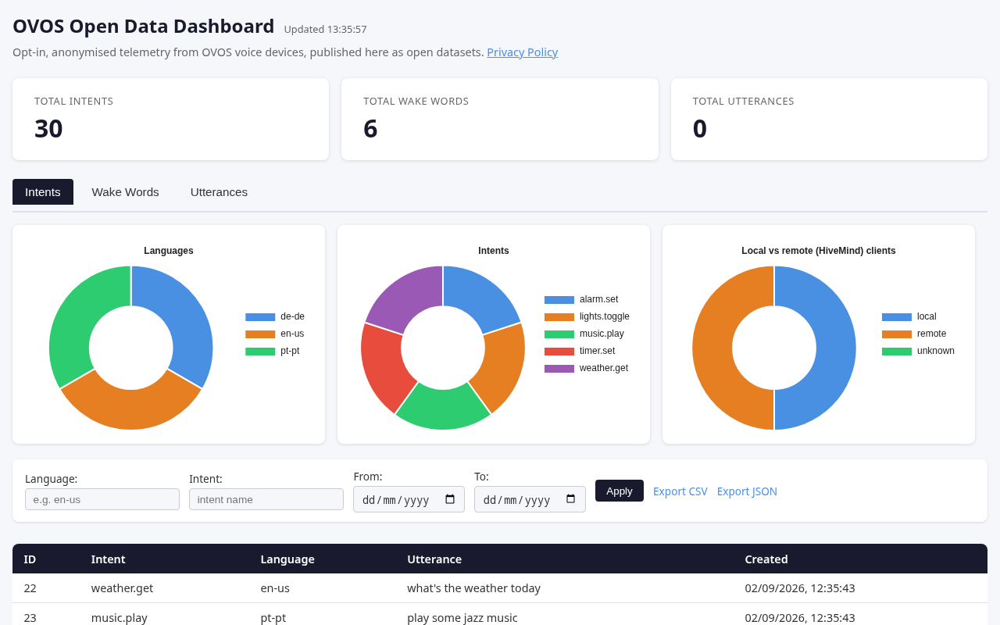

# ovos-opendata-server

A small FastAPI service that turns opt-in telemetry from OVOS voice devices into
open, reusable datasets: wake-word audio, speech-to-text utterances, and intent
matches. Point your device at it, and every sample it uploads becomes part of a
growing, permissively licensed corpus that anyone can use to train and improve
voice models — instead of disappearing into a single company's private servers.

Nothing is collected unless you turn it on. See [privacy.md](privacy.md) for the
full policy, and [docs/connecting-devices.md](docs/connecting-devices.md) for
exactly what each upload contains.

A public instance, run by the OVOS community, is available at
[https://metrics.openvoiceos.pt](https://metrics.openvoiceos.pt) with a
dashboard at [https://metrics.openvoiceos.pt/dashboard/stats](https://metrics.openvoiceos.pt/dashboard/stats).
You can also run your own — see [docs/self-hosting.md](docs/self-hosting.md).



See [docs/dashboard.md](docs/dashboard.md) for a full tour of the dashboard.

## Quick Start

```bash
git clone https://github.com/OpenVoiceOS/ovos-opendata-server
cd ovos-opendata-server
cp .env.example .env        # fill in DATABASE_URL and Postgres credentials
docker compose up --build -d
```

- API: `http://localhost:8007`
- Dashboard: `http://localhost:8007/`

### Docker image

Tagged releases (`v*`) are published to `ghcr.io/openvoiceos/ovos-opendata-server`.

Docker builds the image, starts a Postgres database, and runs pending
migrations automatically before the API comes up. For the full walkthrough —
including seeding demo data and making your first API call — see
[docs/getting-started.md](docs/getting-started.md).

## Configuration

All configuration is via environment variables (`.env.example` provided):

| Variable | Required | Default | Description |
|----------|----------|---------|-------------|
| `DATABASE_URL` | No | `sqlite:///./ovos_opendata.db` | Database DSN. Defaults to a local SQLite file for easy local/dev use — **production deployments should set this to a PostgreSQL DSN**. |
| `MAX_AUDIO_SIZE_MB` | No | `10` | Audio upload size cap in MB |
| `API_KEY` | No | unset | If set, intake endpoints also require a matching `X-API-Key` header |
| `RATE_LIMIT` | No | `60/minute` | Per-IP rate limit applied to intake endpoints |
| `DASHBOARD_CACHE_TTL` | No | `60` | Seconds the `/dashboard/stats` aggregation is cached |

Settings are loaded via `app/config.py` (pydantic-settings), which also reads a
`.env` file if present. The app is importable and runnable without any
environment variables set. Full reference, including the trust model behind
these settings, is in [docs/self-hosting.md](docs/self-hosting.md).

## API Overview

| Method | Path | Auth | Description |
|--------|------|------|-------------|
| POST | `/intents` | UA (+ API key) | Submit an intent match |
| POST | `/wake_word` | UA (+ API key) | Submit a wake-word sample |
| POST | `/stt` | UA (+ API key) | Submit an STT utterance |
| GET | `/intents` | — | Paginated intent list |
| GET | `/wake_words` | — | Paginated wake-word list |
| GET | `/utterances` | — | Paginated utterance list |
| GET | `/wake_words/{id}/audio` | — | Stream wake-word audio |
| GET | `/utterances/{id}/audio` | — | Stream utterance audio |
| GET | `/intents/export` | — | CSV/JSON export |
| GET | `/wake_words/export` | — | CSV/JSON export |
| GET | `/utterances/export` | — | CSV/JSON export |
| GET | `/dashboard/stats` | — | Aggregated stats (cached) |
| GET | `/` | — | Web dashboard |
| GET | `/status` | — | Health check |

**Auth**: intake endpoints require `User-Agent: ovos-metrics`, and — on
instances that set `API_KEY` — a matching `X-API-Key` header. See
[docs/api-reference.md](docs/api-reference.md) for full details, every
parameter, and error codes.

## Documentation

| Guide | For |
|-------|-----|
| [docs/index.md](docs/index.md) | Front door — pick the guide that matches what you're trying to do |
| [docs/getting-started.md](docs/getting-started.md) | Total beginners: run the server locally and make your first request |
| [docs/connecting-devices.md](docs/connecting-devices.md) | OVOS device owners: `mycroft.conf` examples, what gets uploaded, how to verify or stop it |
| [docs/self-hosting.md](docs/self-hosting.md) | Operators: production deployment, env vars, TLS, backups, upgrades |
| [docs/api-reference.md](docs/api-reference.md) | Every endpoint, parameter, and response code |
| [docs/datasets.md](docs/datasets.md) | Data consumers: pulling exports, column meanings, building training sets |
| [docs/development.md](docs/development.md) | Contributors: repo layout, running from source, tests, migrations, CI |
| [docs/dashboard.md](docs/dashboard.md) | How the built-in web dashboard works |
| [FAQ.md](FAQ.md) | Short answers to common questions |
| [privacy.md](privacy.md) | What is collected, why, and your choices |

## Development

```bash
uv pip install -e ".[dev]"
PYTEST_DISABLE_PLUGIN_AUTOLOAD=1 uv run pytest test/ -v --cov=app --cov-report=term-missing
```

See [docs/development.md](docs/development.md) for the full contributor guide:
repo layout, adding a field end-to-end, migrations, and CI.

## Database migrations

Schema changes are managed with [Alembic](https://alembic.sqlalchemy.org/).

- **Production**: run `alembic upgrade head` before starting the server. The
  Docker image does this automatically on container start.
- **Development / tests**: the app still calls `Base.metadata.create_all()`
  on startup for convenience, so a fresh SQLite database works without
  running migrations first.

To create a new migration after changing `app/models.py`:

```bash
alembic revision --autogenerate -m "describe the change"
```

Review the generated file before committing it.

## Related projects

This server is one half of the OVOS open-data loop — the other half lives on
the device:

- [ovos-core](https://github.com/OpenVoiceOS/ovos-core) — the assistant
  runtime; its intent pipeline uploads intent matches (`intent_urls`) when
  `open_data` is enabled in `mycroft.conf`.
- [ovos-dinkum-listener](https://github.com/OpenVoiceOS/ovos-dinkum-listener) —
  the audio pipeline; it uploads wake-word (`ww_urls`) and STT (`stt_urls`)
  samples.
- [ovos-config](https://github.com/OpenVoiceOS/ovos-config) — reads and
  validates `mycroft.conf`, including the `open_data` block.
- [OpenVoiceOS](https://github.com/OpenVoiceOS) — the organization behind the
  whole stack.

## License

Apache License 2.0

## Acknowledgements

This project was developed by [TigreGotico](https://tigregotico.pt) for
OpenVoiceOS under the [ILENIA](https://proyectoilenia.es) project.


> This project was funded by the Ministerio para la Transformación Digital y de
> la Función Pública and Plan de Recuperación, Transformación y Resiliencia -
> Funded by EU – NextGenerationEU within the framework of the project
> [ILENIA](https://proyectoilenia.es) with reference 2022/TL22/00215337
