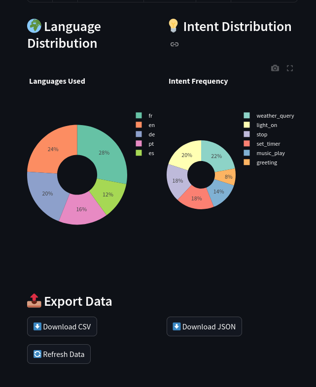

# ovos-opendata-server

FastAPI service that collects anonymised OVOS device metrics — wake-word samples, STT utterances, and intent matches — into PostgreSQL for open dataset building.

## Quick Start

```bash
cp .env.example .env        # fill in DATABASE_URL and credentials
docker compose up --build -d
```

- API: `http://localhost:8007`
- Dashboard: `http://localhost:8007/`

### Docker image

Tagged releases (`v*`) are published to `ghcr.io/openvoiceos/ovos-opendata-server`.

## Configuration

All configuration via environment variables (`.env.example` provided):

| Variable | Required | Default | Description |
|----------|----------|---------|-------------|
| `DATABASE_URL` | No | `sqlite:///./ovos_opendata.db` | Database DSN. Defaults to a local SQLite file for easy local/dev use — **production deployments should set this to a PostgreSQL DSN**. |
| `MAX_AUDIO_SIZE_MB` | No | `10` | Audio upload size cap in MB |
| `API_KEY` | No | unset | If set, intake endpoints require a matching `X-API-Key` header. Off by default. |
| `RATE_LIMIT` | No | `60/minute` | Per-IP rate limit applied to the intake endpoints |

Settings are loaded via `app/config.py` (pydantic-settings), which also reads a `.env` file if present. The app is importable and runnable without any environment variables set.

## API Overview

| Method | Path | Auth | Description |
|--------|------|------|-------------|
| POST | `/intents` | UA | Submit intent match |
| POST | `/wake_word` | UA | Submit wake-word sample |
| POST | `/stt` | UA | Submit STT utterance |
| GET | `/intents` | — | Paginated intent list |
| GET | `/wake_words` | — | Paginated wake-word list |
| GET | `/utterances` | — | Paginated utterance list |
| GET | `/wake_words/{id}/audio` | — | Stream wake-word audio |
| GET | `/utterances/{id}/audio` | — | Stream utterance audio |
| GET | `/intents/export` | — | CSV/JSON export |
| GET | `/wake_words/export` | — | CSV/JSON export |
| GET | `/utterances/export` | — | CSV/JSON export |
| GET | `/dashboard/stats` | — | Aggregated stats (60s cache) |
| GET | `/` | — | Web dashboard |
| GET | `/status` | — | Health check |

**Auth**: All intake endpoints require `User-Agent: ovos-metrics`.

See [docs/api-reference.md](docs/api-reference.md) for full details.

## Development

```bash
uv pip install -e ".[dev]"
uv run pytest test/ -v --cov=app --cov-report=term-missing
```

## License

Apache License 2.0

## Acknowledgements

This project was developed by [TigreGotico](https://tigregotico.pt) for OpenVoiceOS under the [ILENIA](https://proyectoilenia.es) project.



> This project was funded by the Ministerio para la Transformación Digital y de la Función Pública and Plan de Recuperación, Transformación y Resiliencia - Funded by EU – NextGenerationEU within the framework of the project [ILENIA](https://proyectoilenia.es) with reference 2022/TL22/00215337
