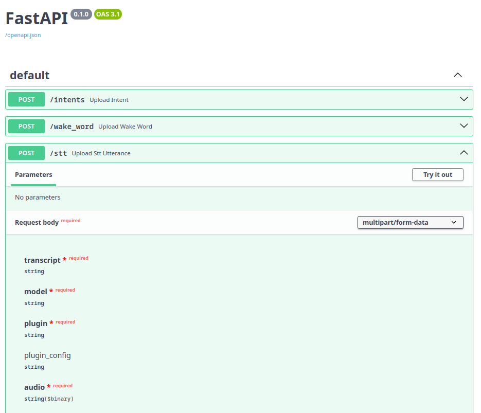
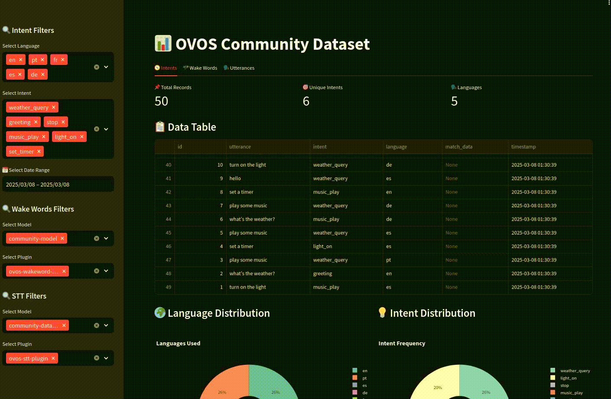

## **OVOS OpenData Collector 📊**  

A **FastAPI service** for collecting anonymized OVOS usage metrics and data with an **interactive Streamlit dashboard** for visualization.  

🚀 **Features:**  
- ✅ **FastAPI backend** to store utterance logs  
- ✅ **PostgreSQL database** for structured storage  
- ✅ **Streamlit dashboard** for data analysis  
- ✅ **Filters, charts, and data export (CSV & JSON)**  
- ✅ **Dockerized setup for easy deployment**  


---

## **🛠️ Setup & Installation**  

### **1️⃣ Clone the Repository**  
```bash
git clone https://github.com/TigreGotico/metrics-server-docker
cd metrics-server-docker
```

### **3️⃣ Start the Services**  
```bash
docker-compose up --build -d
```
This will start:  
- **FastAPI server** on `http://localhost:8000`  
- **PostgreSQL database**  
- **Streamlit dashboard** on `http://localhost:8501`  

---

## **📝 API Usage**  



### **Submit Data (POST)**  

Send anonymized metrics from OVOS:  
```bash
curl -X POST "http://localhost:8000/intents" \
     -H "User-Agent: ovos-metrics" \
     -F "utterance=What’s the weather?" \
     -F "lang=en" \
     -F "intent=weather" \
     -F "match_data={\"pipeline\": \"padatious_high\"}"
```

```bash
curl -X POST "http://localhost:8000/wake_word" \
     -H "User-Agent: ovos-metrics" \
     -F "name=alexa" \
     -F "model=default" \
     -F "plugin=mycroft-precise" \
     -F "plugin_config={\"sensitivity\": 0.5}" \
     -F "audio=@wakeword.wav"
```

```bash
curl -X POST "http://localhost:8000/stt" \
     -H "User-Agent: ovos-metrics" \
     -F "transcript=What’s the weather?" \
     -F "model=whisper" \
     -F "plugin=ovos-stt-plugin-whisper" \
     -F "plugin_config={\"language\": \"en\"}" \
     -F "audio=@utterance.wav"

```

>NOTE: the user agent **must** be `ovos-metrics` otherwise the request is ignored


---

## **📊 Streamlit Dashboard**  


1️⃣ **Open your browser:** `http://localhost:8501`  
2️⃣ **Features:**  
   - 📌 **Filter** by **date range, language, and intent**  
   - 📊 **Pie charts** for **intent & language distribution**  
   - 📥 **Export** data to **CSV & JSON**  
   - 🔄 **Live updates & refresh button**  




---


## **🤝 Contributing**  
1. **Fork the repo** & create a new branch  
2. **Make your changes** & ensure tests pass  
3. **Submit a pull request** 🎉  

---

## **📝 License**  
MIT License - Feel free to use and modify.  
