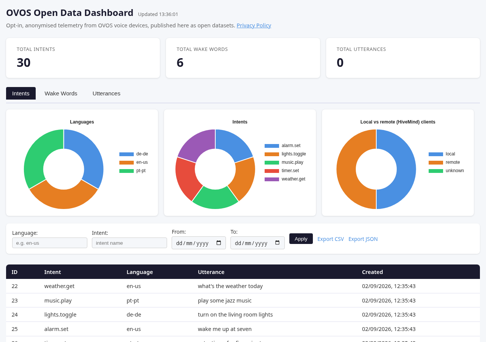
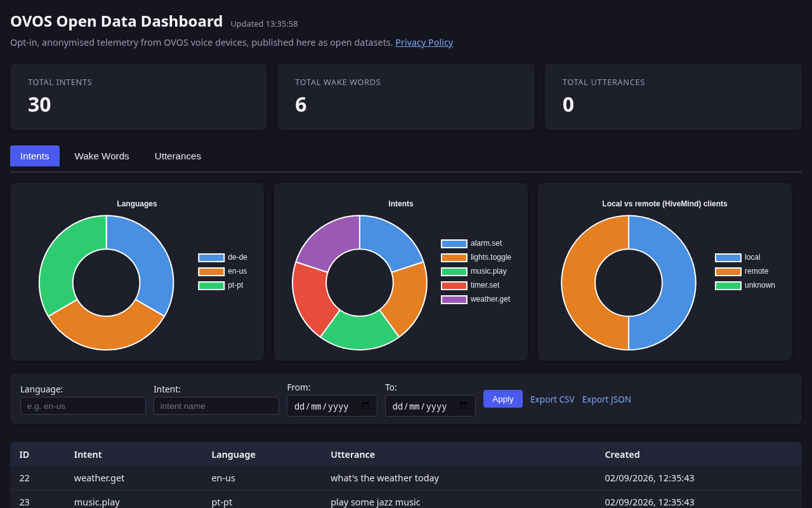
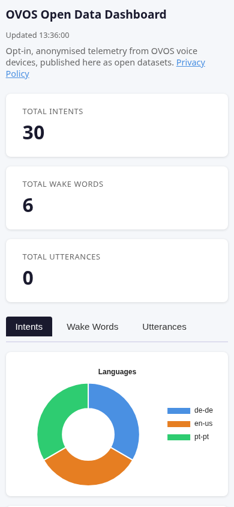

# Dashboard Usage Guide

The web dashboard is served at `GET /` and provides a single-page interface to
explore collected OVOS metrics — no login, no build step, just a page the
server renders.

*Summary cards, per-tab charts, filters, and a paginated table — all on one page.*

## Summary Cards

Three cards at the top show live counts of Total Intents, Total Wake Words, and
Total Utterances, fetched from `GET /dashboard/stats`. A status line next to
the heading shows when the data was last updated, or an error message if the
request failed. Numbers are formatted with the browser's locale via
`Intl.NumberFormat`. Stats are cached server-side for `DASHBOARD_CACHE_TTL`
seconds (default 60) so repeated dashboard loads don't hammer the database.

A one-line strapline under the heading states what the site is — opt-in,
anonymised OVOS telemetry published as open datasets — with a link to the
privacy policy right there, in addition to the footer.

## Auto-Refresh

The dashboard re-fetches `/dashboard/stats` every 60 seconds in the background
and updates the cards and charts in place: existing Chart.js instances are
updated, not recreated, so there is no flicker or memory leak from repeated
renders.

## Tabs

Tab buttons switch between panels client-side; no page reload occurs. Each
panel title is a heading, kept visually hidden since the active tab button
already conveys it, so the document outline stays sound for screen readers.

### Intents Tab

- Language doughnut chart and intent doughnut chart, rendered from
  `/dashboard/stats`.
- A "Local vs remote (HiveMind) clients" doughnut chart, driven by
  `session_distribution` — a privacy-respecting proxy that only ever counts a
  boolean (whether the reporting session used the default session id), never
  a session id itself; older devices that don't send the flag are counted as
  "unknown".
- Filters: language, intent name, date range. Date inputs use the browser's
  native picker; table timestamps are rendered in your locale, with the exact
  ISO instant available as a tooltip on each cell.
- Paginated table (50 rows/page) with ID, intent, language, utterance, and
  timestamp. On narrow screens the ID column is hidden to keep the table
  usable without horizontal scrolling.
- Export links dynamically update to include your active filters: CSV
  (`/intents/export?format=csv`) and JSON.

### Wake Words Tab

- Bar chart of wake-word name distribution.
- Filters: name, plugin (hover the header for what "plugin" and "model" mean
  in each table).
- Paginated table with a **Play** button per row — streams audio from
  `/wake_words/{id}/audio` via a browser blob URL.

### Utterances Tab

- Filters: language, model, plugin.
- Paginated table with a **Play** button per row — streams audio from
  `/utterances/{id}/audio`.

Each tab shows its own loading/error status line above its table, so a slow
or failed request on one tab doesn't block the others. When a chart or table
has no data for the current filters, it shows "No data yet for this category"
instead of a blank canvas or an empty table.

*The Intents tab with charts, filters, and a populated table.*

## Audio Modal

Clicking **Play** opens a modal dialog with an HTML `<audio>` element. Audio
is fetched as a blob and played inline. Focus moves to the close button on
open; Escape or the × button closes it.

## Dark Mode

The dashboard follows the operating system's color scheme automatically; no
toggle is needed. Charts re-theme in place when the scheme changes.

*The same dashboard following the OS dark color scheme.*

## Mobile Layout

Below 640px, cards stack into a single column, filters stack vertically, and
the ID column is dropped from tables to avoid horizontal scrolling.

*Summary cards and the Intents tab on a 390px-wide viewport.*

## Static Assets

- `/static/css/dashboard.css` — `app/static/css/dashboard.css`
- `/static/js/dashboard.js` — `app/static/js/dashboard.js`
